<div align="center">

  <picture>
    <source media="(prefers-color-scheme: dark)" srcset="./public/logo-light.png">
    <source media="(prefers-color-scheme: light)" srcset="./public/logo-dark.png">
    
  </picture>

  # ARCH

  ### **Arch - Personal Life Command Center**

  [](https://react.dev/)
  [](https://vitejs.dev/)
  [](https://tailwindcss.com/)
  [](https://developer.mozilla.org/en-US/docs/Web/CSS)
  [](https://firebase.google.com/)
  [](https://zustand-demo.pmnd.rs/)
  [](./LICENSE)

  <br />

  **A high-performance, privacy-first, Neo-Brutalist personal life command center designed to seamlessly organize tasks, daily journals, workout routines, coding challenges, IMDb movie watchlists, wardrobe outfits, milestone goals, expenses, and system analytics.**

  [**🚀 Explore Live Demo**](https://arch-os.netlify.app/) • [**📖 Documentation**](#key-features) • [**⚡ Quick Start**](#quick-start)

</div>

---

## 📸 Visual Showcase

<div align="center">

| **Dashboard Overview** | **Daily Journal & Sleep Tracker** |
| :---: | :---: |
| 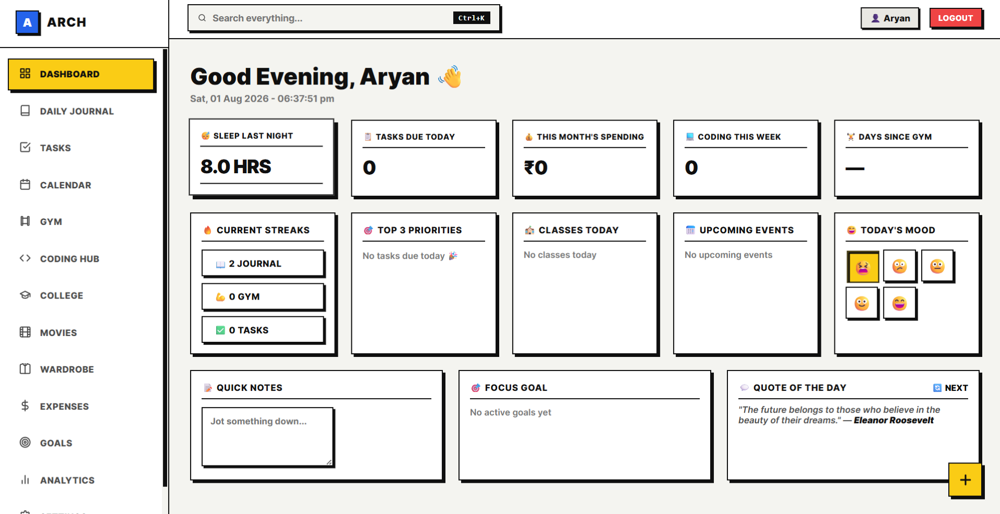 | 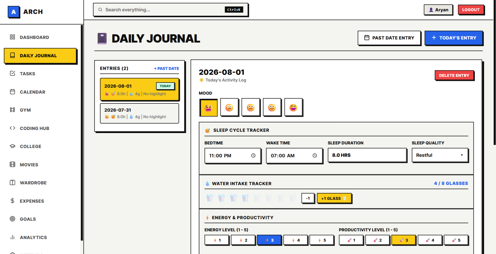 |
| **Task Management** | **Interactive Calendar** |
| 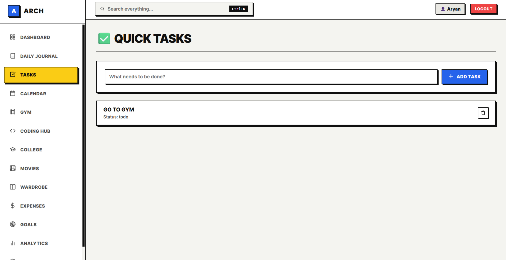 | 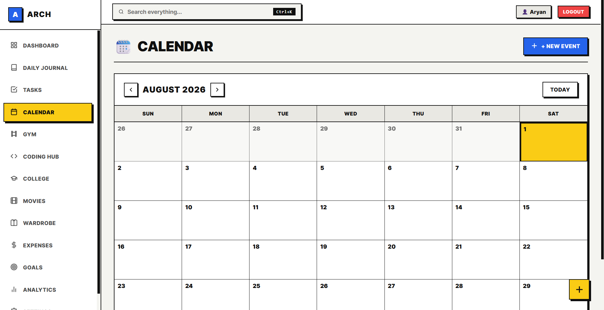 |
| **Gym & Workout Tracker** | **Coding & LeetCode Hub** |
| 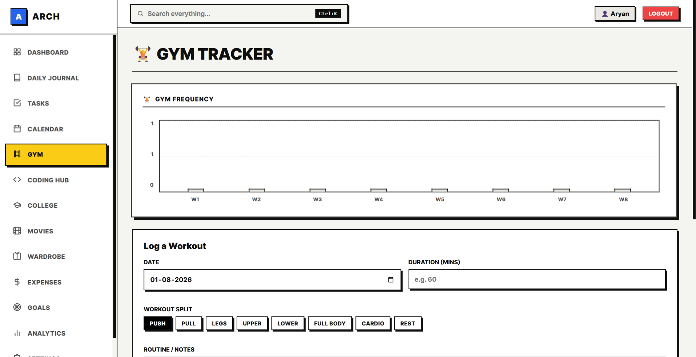 | 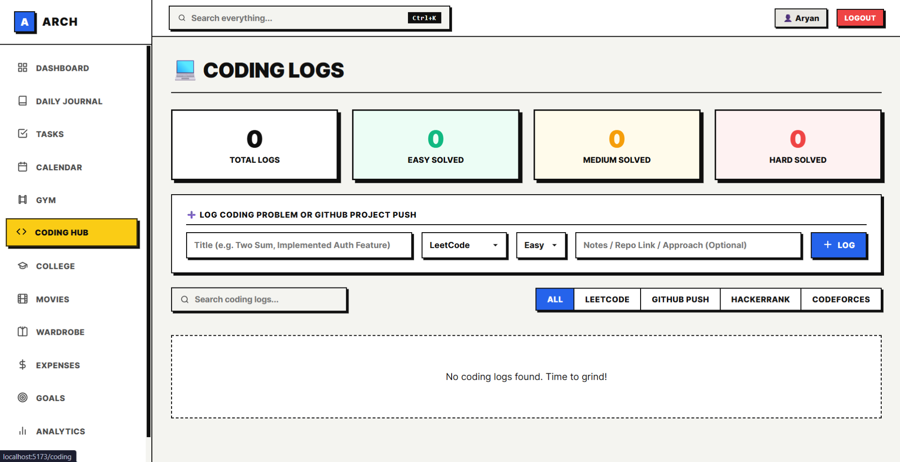 |
| **College & Academic Hub** | **Movies & Media Watchlist** |
| 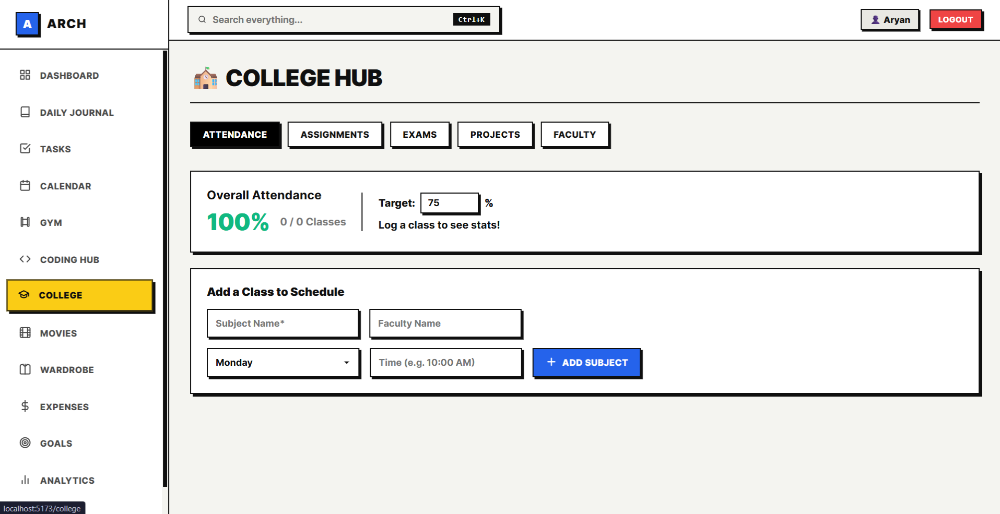 | 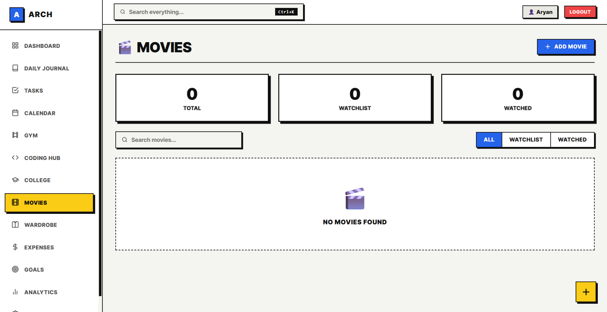 |
| **Wardrobe & Outfit Studio** | **Expenses & Budget Manager** |
| 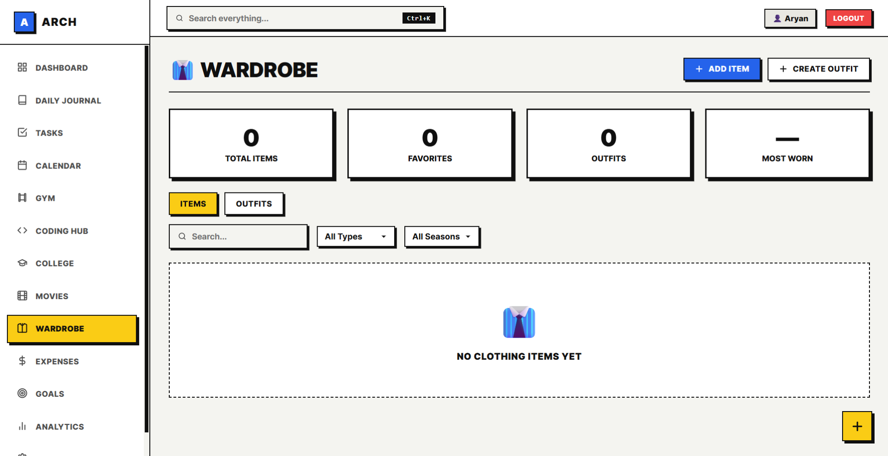 | 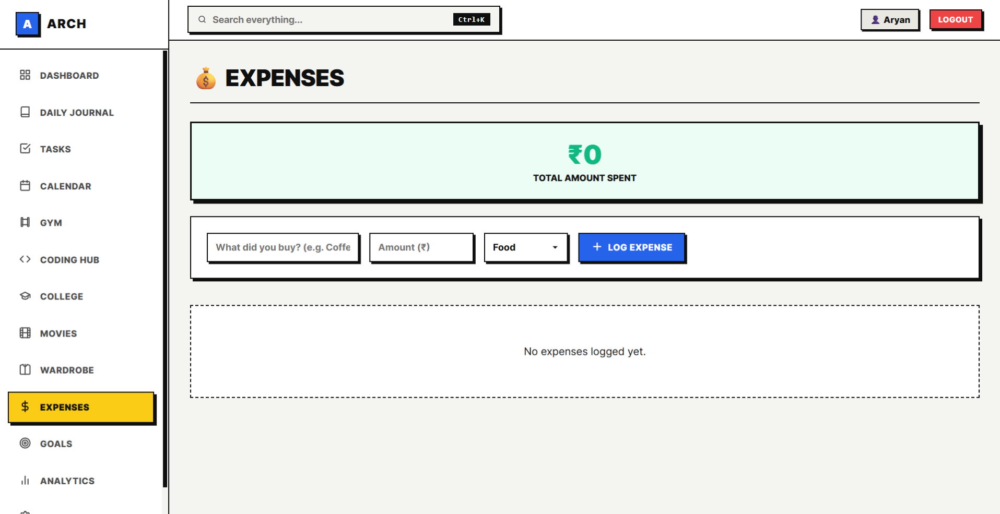 |
| **Milestone Goals Hub** | **Productivity & System Analytics** |
| 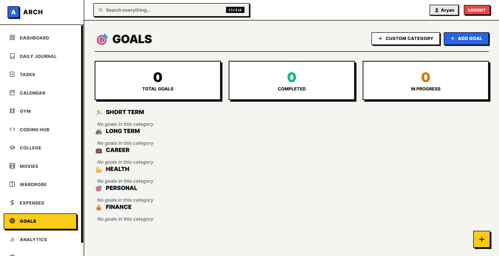 | 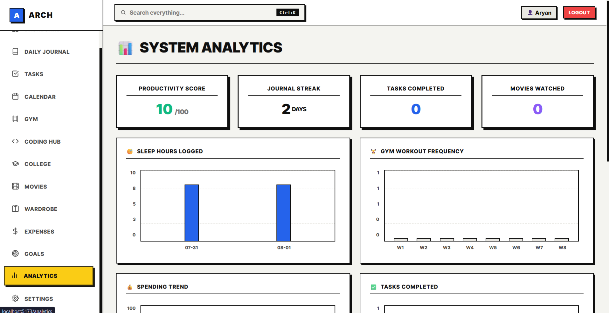 |
| **Global Command Palette** | **System Settings & Custom Themes** |
| 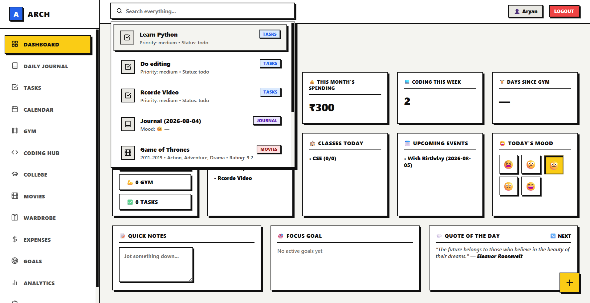 | 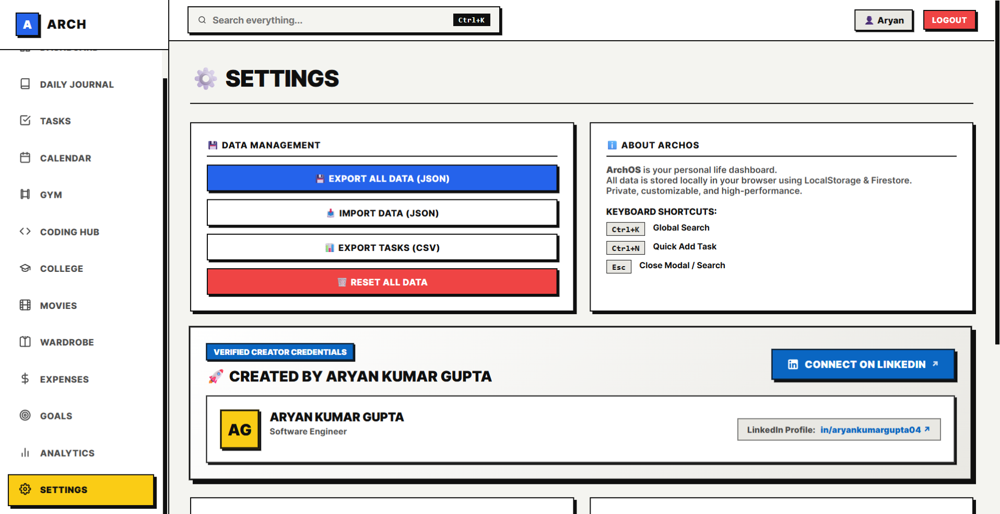 |

</div>

---

## ✨ Key Features

**⚡ 1. Command Center** — Live clock, greeting, streak counters, mood logger, quick scratchpad, and quotes.

**📓 2. Journal & Sleep Tracker** — Daily journal, sleep metrics (bedtime/wake/quality), water intake, energy scale, gratitude, habits.

**📋 3. Task Management** — Tasks by status (Pending/In Progress/Completed) and priority, with fast batch create/edit/delete.

**🗓️ 4. Calendar** — Custom events with type, date, notes, color tags; month grid with "Today" jump.

**🏋️ 5. Gym Log** — Track exercises, sets/reps/weight, muscle groups, workout history, and streaks.

**💻 6. Coding Hub** — Log LeetCode, GitHub, Codeforces, HackerRank activity with difficulty breakdowns.

**🎓 7. College Hub** — Timetable, attendance %, and assignment/exam deadline tracker.

**🎬 8. Movies Watchlist** — IMDb auto-fetch (poster, rating, year, plot), fuzzy search, 5-star user ratings.

**👔 9. Wardrobe Studio** — Clothing catalog by category/season, outfit builder, wear-count tracker.

**💰 10. Expenses** — Income/expense logs by category with auto-calculated balance.

**🎯 11. Milestone Goals** — Goals broken into sub-tasks with progress bars, organized by category.

**📊 12. Analytics** — 0–100 productivity score + charts for sleep, spending, workouts, and coding activity.

**🔍 13. Command Palette** — `Ctrl+K` instant search across all modules.

**⚙️ 14. Theme Engine** — 7 color themes, custom accent picker, full JSON/CSV data export-import.

---

## 🛠 Technical Stack

| Domain | Technology | Description |
| :--- | :--- | :--- |
| **Core Framework** | [React 19](https://react.dev/) | Component-based UI library with modern hooks |
| **Build Tool** | [Vite 8](https://vitejs.dev/) | Fast HMR build tool and dev server |
| **Styling & Theme** | Vanilla CSS + [Tailwind CSS 3](https://tailwindcss.com/) | Custom Neo-Brutalist Design System with CSS Variables |
| **State Management** | [Zustand 5](https://zustand-demo.pmnd.rs/) | Lightweight central state management with persistent storage |
| **Database & Auth** | [Firebase 12](https://firebase.google.com/) | Real-time Cloud Firestore & Google OAuth Authentication |
| **Routing** | [React Router DOM 7](https://reactrouter.com/) | Declarative client-side SPA routing |
| **Deployment** | [Render](https://render.com/) / [Netlify](https://www.netlify.com/) | Static web app hosting with automated CI/CD pipeline |

---

## ⚡ Quick Start

### Prerequisites
Make sure you have the following installed on your machine:
- **Node.js**: `v18.0.0` or higher
- **npm**: `v9.0.0` or higher

### Installation Steps

1. **Clone the Repository**
   ```bash
   git clone https://github.com/aryankumar-04/Arch.git
   cd Arch
   ```

2. **Install Dependencies**
   ```bash
   npm install
   ```

3. **Configure Environment Variables**
   Create a `.env` file in the root directory and add your Firebase configurations:
   ```env
   VITE_FIREBASE_API_KEY=your_api_key
   VITE_FIREBASE_AUTH_DOMAIN=your_auth_domain
   VITE_FIREBASE_PROJECT_ID=your_project_id
   VITE_FIREBASE_STORAGE_BUCKET=your_storage_bucket
   VITE_FIREBASE_MESSAGING_SENDER_ID=your_sender_id
   VITE_FIREBASE_APP_ID=your_app_id
   ```

4. **Launch Development Server**
   ```bash
   npm run dev
   ```
   Open your browser at `http://localhost:5173`.

---

## 📦 Production Build

To compile a production-ready static bundle for deployment:

```bash
# Generate optimized distribution build
npm run build

# Local preview of the production build
npm run preview
```

The output will be generated inside the `dist/` directory.

### Deploying to Render
1. Connect your repository to **[Render.com](https://render.com/)**.
2. Create a new **Static Site**.
3. Set **Build Command**: `npm install && npm run build`
4. Set **Publish Directory**: `dist`
5. Add environment variables in the Render Dashboard under **Environment Variables**.

---

## 📁 Repository Architecture

```
Arch/
├── public/
│   ├── favicon.svg
│   ├── icons.svg
│   ├── _redirects
│   └── img/                 # 14 Showcase screenshots
│       ├── analytics.png
│       ├── calander.png
│       ├── coding-hub.png
│       ├── collage.png
│       ├── daily-journal.png
│       ├── dashboard.png
│       ├── expenc.png
│       ├── goals.png
│       ├── gym.png
│       ├── movies.png
│       ├── search.png
│       ├── settings.png
│       ├── task.png
│       └── wardrobe.png
├── src/
│   ├── assets/
│   ├── components/          # Reusable UI components & modals
│   ├── lib/                 # Firebase integration & configuration
│   ├── pages/               # Application view modules (Dashboard, Journal, etc.)
│   ├── store/               # Zustand state stores (Task, Calendar, Auth, etc.)
│   ├── styles/              # Global Neo-Brutalist CSS stylesheets
│   ├── utils/               # Storage, date, and helper functions
│   ├── App.jsx
│   └── main.jsx
├── .env.example
├── index.html
├── package.json
├── vite.config.js
└── README.md
```

---

## 👨‍💻 Author

<div align="center">

### **Aryan Kumar Gupta**
*Software Engineer*

[](https://github.com/aryankumar-04)
[](https://www.linkedin.com/in/aryankumargupta04)
[](https://arch-kx4x.onrender.com/)

</div>

---

## 📄 License

This project is licensed under the **MIT License** — see the [LICENSE](./LICENSE) file for details.

<div align="center">
  <sub>Built with ❤️ by Aryan Kumar Gupta</sub>
</div>
